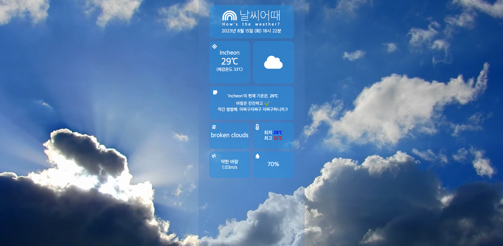
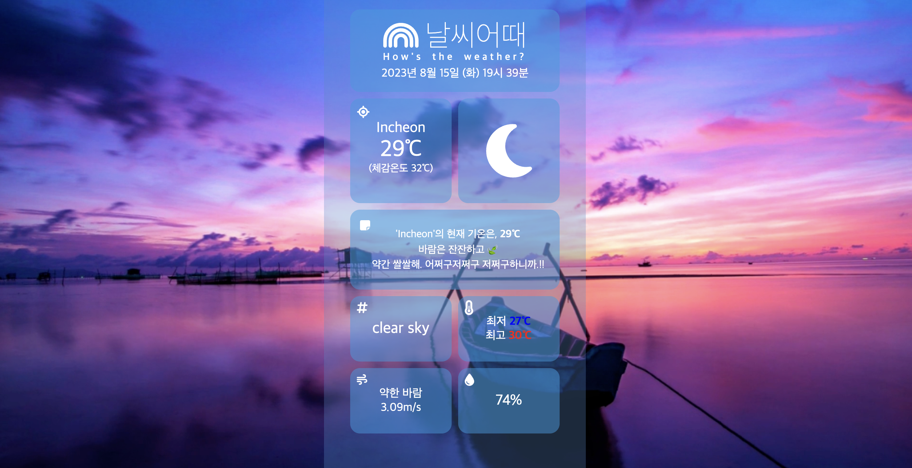
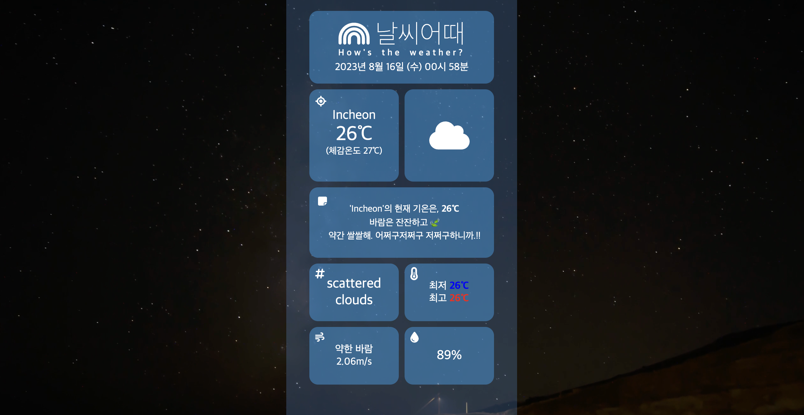

# 날씨어때(How's the weather?)

## 🔷 Description

A web site that provides weather status.

## 🔷 URL

- Web Site: https://jiyaho.github.io/react-how_is_the_weather
- Github Repository: https://github.com/Jiyaho/react-how_is_the_weather

## 🔷 Screenshot






## 🔷 Features Available on this Web Site

- 사용자의 Geolocation 데이터를 통해, 유저가 접속한 위치의 실시간 날씨 현황 제공.
- 오늘 날짜, 현재 시각, 현재 위치, 실시간 기온, 체감 온도, 바람 속도, 최저 및 최고 기온, 습도 등.
- 최저 및 최고 기온의 경우, 현재 위치(도시)의 평균 최저/최대 기온을 선택적으로 나타낸 매개 변수이므로 데이터는 참고적으로 보시기 바랍니다.

## 🔷 사용 스택 및 스킬

<div>
    
    
    
</div>

## 🔷 File Tree Structure

```
📦 react-how_is_the_weather
├─.gitignore
├─README.md
├─package-lock.json
├─package.json
├─public
└─ src
   ├─ App.js
   ├─ components
   │  ├─ Background.js
   │  ├─ ConvertCoordinate.js
   │  ├─ Footer.js
   │  ├─ Header.js
   │  └─ WeatherApi.js
   ├─ css
   │  └─ App.module.css
   ├─ index.js
   └─ routes
      └─ Main.js
```

## 🔷 Used API

- OpenWeather Current weather data
  - https://openweathermap.org/current
